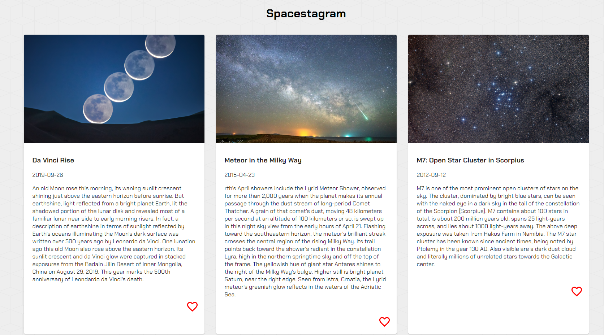
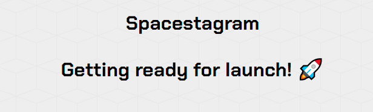

# Spacestagram

## Table of Contents

[Description](#description)

[Technology](#technology)

[Installation](#installation)

[Links](#links)

[Usage](#usage)

[Screenshots](#screenshots)

[Questions](#questions)

[License](#license)

## Description
An application that shares photos and related information from NASA’s Astronomy Picture of the Day API. Conditional rendering is used to display a loading message while the application waits for NASA’s API to return data. Once data is return the image cards are displayed. Material-UI has been used to create the image cards with images, content and a button. The button with a heart icon can be clicked by the user to indicate they like the image which results in the heart being filled in. Users can click on the heart again if they wish to unlike it and it will no longer be filled in. If a image is liked or not is tracked using useState from the React library. React components have been created (e.g. Footer, Header, ImageCard) for the applicaton. Semantic HTML tags are in place along with accessibility features including alternative text for images. The application is responsive with image cards flexing within a container based on screen size.

## Technology
Key technologies and npm packages used in this project:
- React
- HTML
- CSS (including Material-UI)
- JavaScript / JSX
- Google Fonts

## Installation
Fork a copy of the repository, install dependencies by running 'npm install' followed by 'npm run start' to launch the application on your local host.

## Links
- [GitHub repository](https://github.com/darylnauman/spacestagram)
- [Deployed application](https://darylnauman.github.io/spacestagram/)

## Usage
Visit the deployed application, view the images displayed and read about each of them. Users can like and unlike the images as desired.

## Screenshots
#### Main Page

#### Loading Page

## Questions
If you have any questions please contact me. I'm happy to help!

## License
This product is under the MIT License.